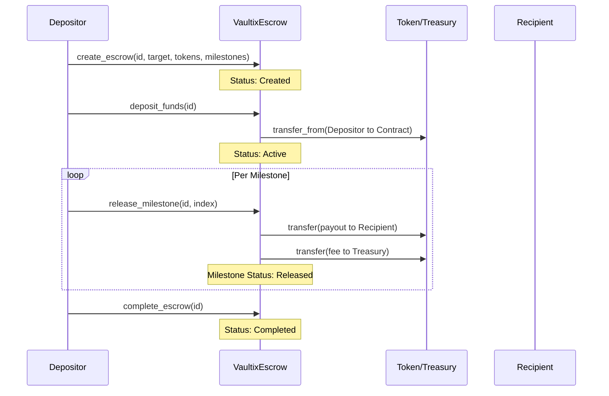
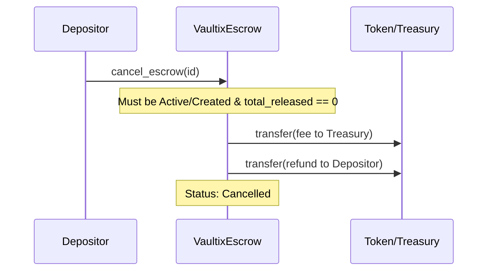
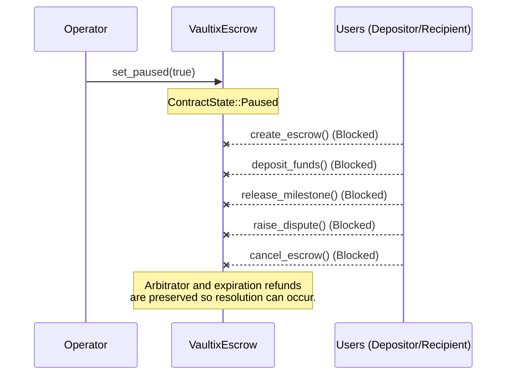
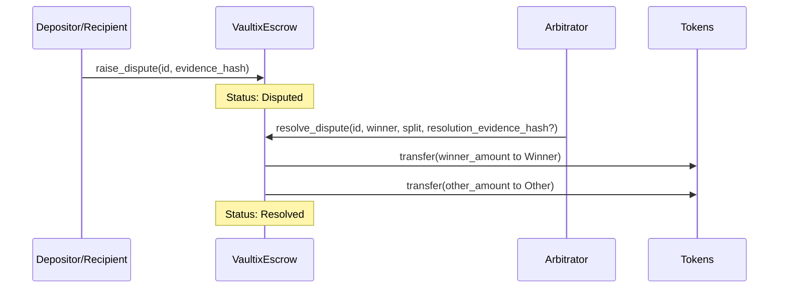
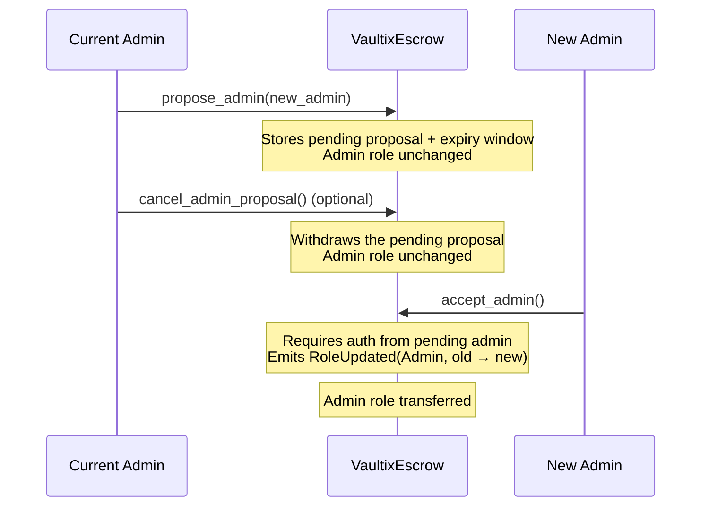

# Contract Workflows

This document visualizes the major workflows of the `VaultixEscrow` contract.

## 1. Happy Path

The intended scenario where both parties fulfill their obligations without disputes.

## 2. Cancellation

An escrow can be canceled prior to any funds being released, resulting in a refund minus any configured fees.

## 3. Emergency Pause (Circuit Breaker)

The Operator can pause the core functions of the contract to halt potential exploits or logic errors.

## 4. Dispute Resolution

If a disagreement arises, either party can raise a dispute, locking the escrow until the Arbitrator steps in. Raising a dispute requires an `evidence_hash` anchoring the off-chain evidence; the Arbitrator may optionally anchor its own `resolution_evidence_hash` with the ruling. See "Dispute Evidence Hash Interop" in `README.md` for the digest convention.

## 5. Admin Transfer (Two-Step)

A single `set_admin` typo used to permanently lock out contract governance. The
admin role now changes only through a propose/accept handshake: the current
admin stages a pending proposal, and only the pending admin — by authenticating
as themselves — can complete the transfer. A pending proposal expires after
`ADMIN_PROPOSAL_WINDOW_SECS` (7 days); the current admin can withdraw it at any
time with `cancel_admin_proposal`.

